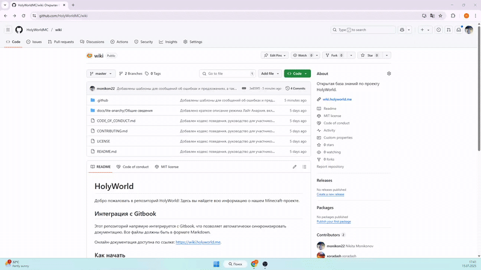
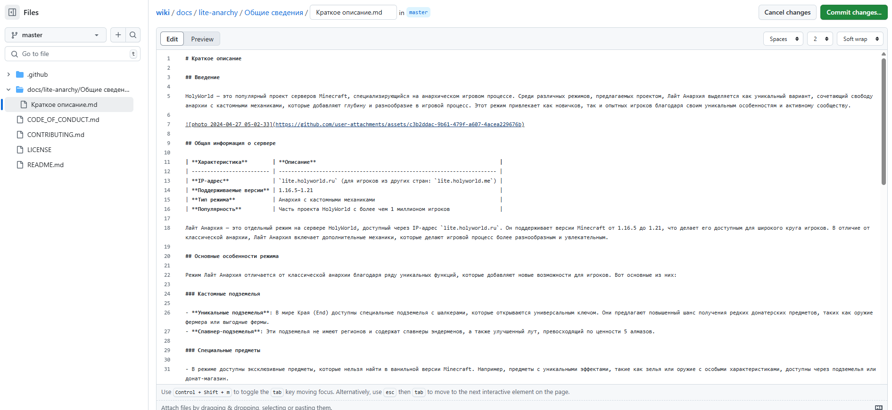
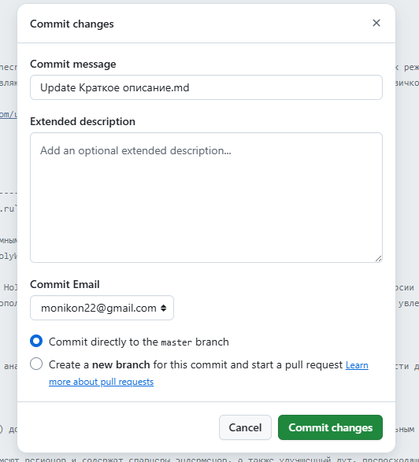
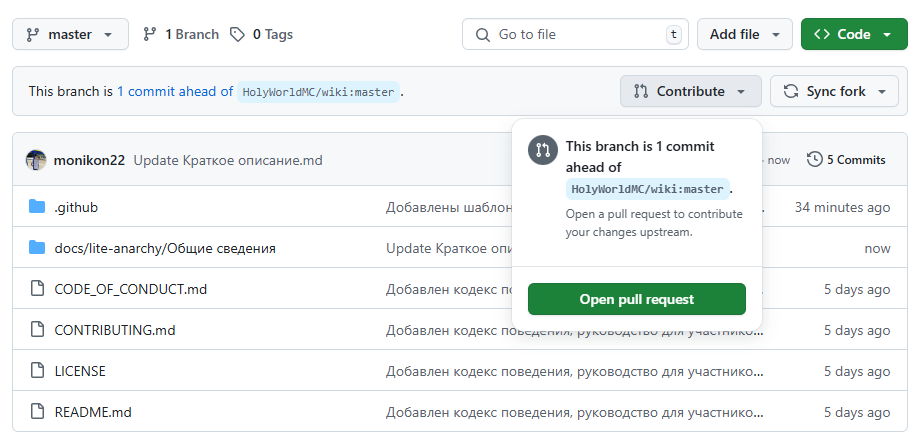

# Руководство для участников

Спасибо за ваш интерес к проекту HolyWorld! Мы приветствуем вклад от всех участников. Пожалуйста, следуйте этим рекомендациям, чтобы ваш вклад был принят.

## Награды за вклад

За каждый принятый вклад вы получаете награду в виде коинов и других призов. Размер награды определяется администратором и зависит от значимости вашего вклада в развитие базы знаний. Поэтому важно указывать свой настоящий никнейм в Pull Request, чтобы мы могли правильно начислить награду.

## Как внести вклад

1. Ознакомьтесь с текущими задачами в разделе Issues.
2. Если вы хотите предложить новую функцию или улучшение, создайте новую задачу, используя [ISSUE_TEMPLATE.md](ISSUE_TEMPLATE.md).
3. Форкните репозиторий и приступите к редактированию репозитория в любом удобном для вас редакторе (можно и в самом github или github.dev).

4. Убедитесь, что ваши изменения соответствуют стандартам проекта (см. ниже).

5. Сделайте Commit своих изменений.

6. Отправьте Pull Request в оригинальный репозиторий и опишите внесенные изменения.

## Требования к Pull Request

- Все статьи заполняются в формате Markdown: https://commonmark.org/help/.
- Статьи должны размещаться по структуре: `docs/режим/тема/статья.md`.
- Все медиа-файлы (изображения, видео и т.д.) помещаются в директорию с темой: `docs/режим/тема/assets`.
- Соблюдайте правила, описанные в [CODE_OF_CONDUCT.md](CODE_OF_CONDUCT.md).

## Кодекс поведения

Мы ожидаем, что все участники будут соблюдать уважительное и профессиональное поведение. Подробнее читайте в [CODE_OF_CONDUCT.md](CODE_OF_CONDUCT.md) (если применимо).

## Связь

Если у вас есть вопросы, свяжитесь с нами через вкладку обсуждения или по электронной почте: support@holyworld.io
