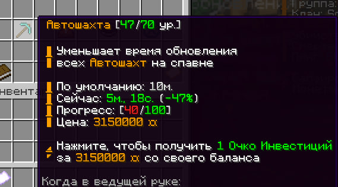
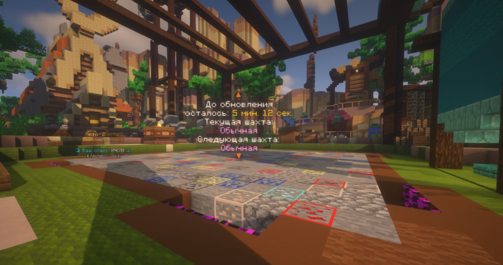
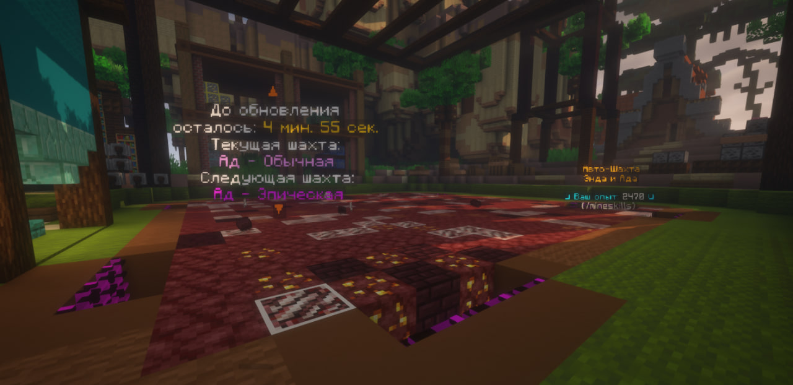
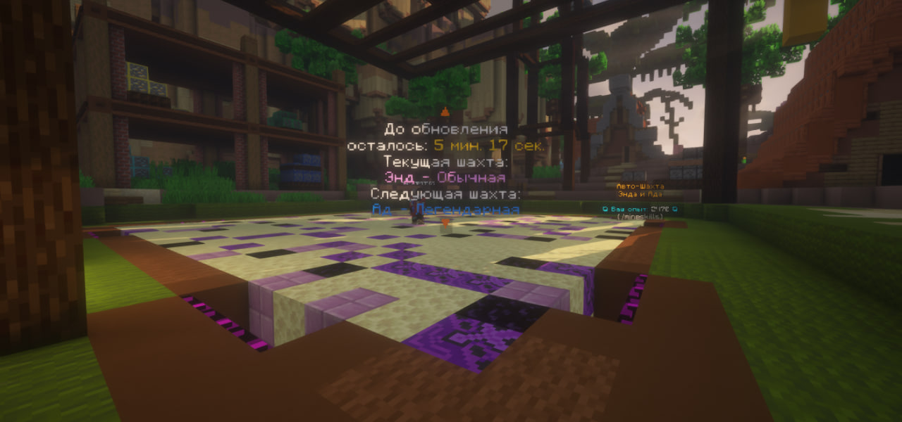
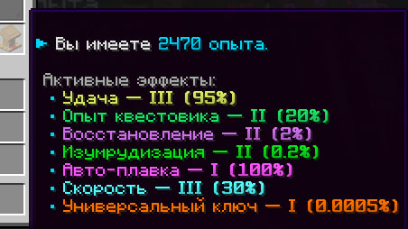

# Автошахта

Автошахта - это место для добычи ресурсов игроками. которое находится на спавне. Суть автошахты в том, что она находится на спавне и постоянно обновляется. \
**Существует три типа автошахты**:

- Шахта верхнего мира
- Шахта нижнего мира
- Шахта эндер мира

**Также существует всего три редкости автошахты:**

- Обычная шахта
- Эпическая шахта
- Легендарная шахта
  В зависимости от редкости автошахты меняется процентное ее наполнение.

## Обновление автошахты

Автошахта обновляется в определенный промежуток времени, который можно посмотреть по команде `/invest`

Если не хотите ждать, пока автошахта обновится, то можно обновить автошахту за сапфиры у NPC **Опытный шахтер**

**Цены на обновление шахты:**
| Измерение шахты | Редкость шахты | Стоимость |
|-------------|-------------|-------------|
| Верхний мир | Обычная шахта | 79 сапфиров |
| Верхний мир | Эпическая шахта | 99 сапфиров |
| Верхний мир | Легендарная шахта | 119 сапфиров |
| Нижний мир | Обычная шахта | 89 сапфиров |
| Нижний мир | Эпическая шахта | 109 сапфиров |
| Нижний мир | Легендарная шахта | 129 сапфиров |
| Энд мир | Обычная шахта | 89 сапфиров |
| Энд мир | Эпическая шахта | 109 сапфиров |
| энд мир | Легендарная шахта | 129 сапфиров |

## Шахта верхнего мира

В этой автошахте все руды и блоки верхнего мира: алмазная руда, золотая руда, железная руда, лазурит, редстоун руда, уголь а также **взрывчатое вещество**

### Обычная шахта (наполнение в %):

Алмазная руда (2%), золотые слитки (5%), железные слитки (5%), лазурит (7%), редстоун руда (8%), уголь (9%)

### Эпическая шахта (наполнение в %):

Алмазная руда (5%), золотые слитки (8%), железные слитки (8%), лазурит (5%), редстоун руда (5%), уголь (3%)

### Легендарная шахта шахта (наполнение в %):

Древние обломки (1%), алмазная руда (5%), золотые слитки (8%), железные слитки (8%), лазурит (5%), редстоун руда (5%), уголь (5%), взрывчатое вещество (1%)

## Шахта нижнего мира

В этой автошахте все руды и блоки нижнего мира: древние обломки, золотая адская руда, кварц. руда.

### Обычная шахта (наполнение в %):

Древние обломки (1%), золотая адская руда (10%), кварц. руда (15%)

### Эпическая шахта (наполнение в %):

древние обломки (2%), золотая адская руда (20%), кварц. руда (30%)

### Легендарная шахта (наполнение в %):

древние обломки (4%), золотая адская руда (30%), кварц. руда (50%)

## Шахта эндер мира

В этой автошахте все руды и блоки эндер мира: блоки с эндер-перлами, блоки с хорусами, обсидиан.

### Обычная шахта (наполнение в %):

Блоки с эндер-перлами (10%), блоки с хорусами (10%), обсидиан (8%).

### Эпическая шахта (наполнение в %):

Блоки с эндер-перлами (10%), блоки с хорусами (10%), обсидиан (15%).

### Легендарная шахта (наполнение в %):

Блоки с эндер-перлами (15%), блоки с хорусами (15%), обсидиан (25%).

## Квестовик

Это NPC, который выдает задания и награды за прогресс на автошахте. За выполнения заданий вы получаете бонусы, которые помогают в игре\
Пример бонусов и их шансы:

### Как заработать опыт?

Опыт дается за добычу блоков **на автошахте**. Чем ценее блок, тем больше опыта за него

### Как получать бонусы?

За опыт открываются новые уровни бонусов: скорость, удача, авто-плавка и др. Прогресс и активные бонусы можно посмотреть через NPC у автошахты или прописать команду `/minerskills`

### Куда девать опыт?

Самые лучшие шахтеры, занявшие место в топе, получат ценные награды! О наградах смотрите информация в группе сервера VK или в Telegram

