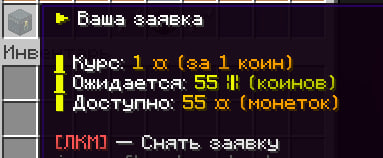
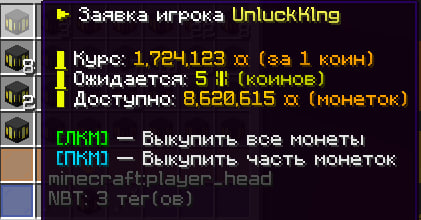

# Биржа

Биржа - место, где игроки могуть продавать и покупать монеты за коины (коины покупаются на сайте). Чтобы открыть биржу нужно прописать команду /exchange.

## Создание заявки на продажу монет

Чтобы продать монеты нужно создать заявку, указав курс обмена монет к коину (можно оставить автоматический курс, либо написать свой)

## Активные заявки

Ваши активные заявки на продажу монет можно посмотреть. Чтобы ее снять нажмите лкм.

## Покупка монет

Найдите интересующий вас лот и нажмите на него. Можно купить все монеты с лота или же часть. Изменять количество монет можно через стеклянные панели или через указание курса обмена

