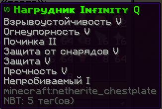
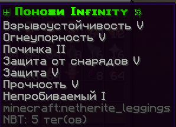
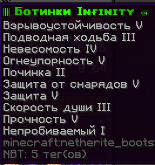

# Пвп анархия

**Пвп анархия** - это сервер предназначеный для тренировки пвп и для зарабатывания сапфиров (при убийстве игрока, даются сапфиры за ценность его предметов)

---

Для покупки пвп инвентаря используется команда `/shop `

Для продажи `/inv sell`

---

**Имеются 3 доступных кита:**

- " NewBie ", стоимость 39 сапфиров ⇩

  

- " Improved ", стоимость 55 сапфиров ⇩

  

- " toper ", стоимость 77 сапфиров ⇩

  

\*Отличие набора toper от других в том, что в нем броня infinity  
 

 

---

Так же есть магазин расходников

(все предметы из этого списка стоят не более 8 сапфиров )
