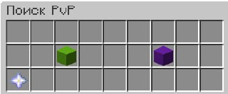
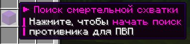

# Пвп дуэли

**Пвп-дуэли** – это игровая механика, которая позволяет быстро найти противника для сражения и выбрать один из доступных режимов поединка.
**_

**Существует 2 вида дуэлей:** 

* **Поединок (зеленая шерсть)** - 2 игрока телепортируются в верхний мир на /rtp long, вдали от игроков и им дается режим боя. *Возможно ливнуть* если кд пройдет.

* **Смертельная схватка (фиолетовая шерсть)** - 2 игрока телепортируются в мир 3 на 3 чанка, окруженный границей и регионом, дается постоянно режим боя и игра длится до смерти одного из участников. *Ливнуть без победы/поражения невозможно.*

