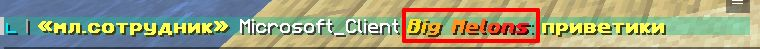

# Титул

**Титул** - надпись, отображаемая около игрового имени в чате и табе. Всего существует два вида титулов: **Сезонные** и **Кастомные**

---

**Сезонные титулы** - это титулы которые можно получить из _кейсов с титулами_ и они доступны к получению только в определённые сезоны ( Лето, Зима, Осень, Весна )

Пример:

---

**Кастомные титулы** - это титулы в которых игрок может написать что хочет, выбрать любой цвет и поменять шрифт. Такие титулы возможно получить только купив на [сайте сервера](https://holyworld.ru/payment/lite/3200) или выйграв в розыгрышах.

Пример:

