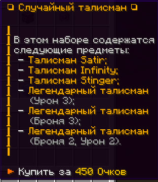
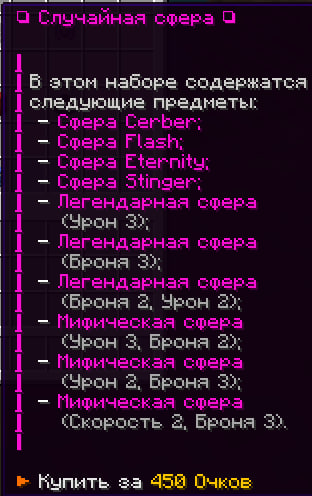

## 9. Боевой пропуск

Боевой пропуск позволяет получать ценные награды за выполнение различных заданий через команды:

- `/battlepass` — открытие меню боевого пропуска  
- `/bp` — открытие меню боевого пропуска  
- `/bpshop` — магазин боевого пропуска

### Задания

Вы получаете засекреченные задания, которые становятся видимыми только после клика.  
У каждого задания есть уровень сложности и ограничение по времени.

- Чем выше сложность — тем выше награда.  
- За выполнение заданий вы получаете **очки**.

**Важно:** Выполняя задания, вы также увеличиваете **коэффициент (множитель)** боевого пропуска.  
Чем выше коэффициент — тем больше очков вы получаете за каждое следующее задание.

### Очки

- Очки можно тратить в `/bpshop` на различные товары.  
- Каждый день в 00:00 с баланса автоматически сгорает 5% очков.  
- При наличии **PREMIUM** вы будете получать на 25% больше очков. Это также помогает быстрее увеличивать коэффициент.

## Магазин боевого пропуска (`/bpshop`)

### Случайный талисман — 450 очков

Содержимое:

- Талисман Satir  
- Талисман Infinity  
- Талисман Stinger  
- Легендарный талисман (Урон 3)  
- Легендарный талисман (Броня 3)  
- Легендарный талисман (Броня 2, Урон 2)  

### Случайная сфера — 450 очков

Содержимое:

- Cфepa Cerber  
- Cфepa Flash  
- Сфера Eternity  
- Cфepa Stinger  
- Легендарная сфера (Урон 3)  
- Легендарная сфера (Броня 3)  
- Легендарная сфера (Броня 2, Урон 2)  
- Мифическая сфера (Урон 3, Броня 2)  
- Мифическая сфера (Урон 2, Броня 3)  
- Мифическая сфера (Скорость 2, Броня 3)  

### Случайная часть брони — 450 очков

Содержимое:

- Шлем Infinity  
- Нагрудник Infinity  
- Штаны Infinity  
- Ботинки Infinity  
- Шлем Eternity  
- Нагрудник Eternity  
- Штаны Eternity  
- Ботинки Eternity  
- Шлем Солнца  
- Меч Eternity  

### Боевой фрагмент — 100 очков (только для PREMIUM)

Позволяет прокачивать коэффициент боевого пропуска и получать больше очков.  
Можно обменивать фрагменты на очки через `/fragment swap`.

### Контейнер — 2500 очков (только для PREMIUM)

### Яйцо дракона ×1 — 5000 очков (только для PREMIUM)

