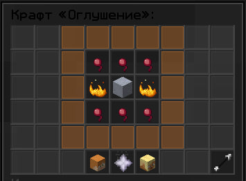
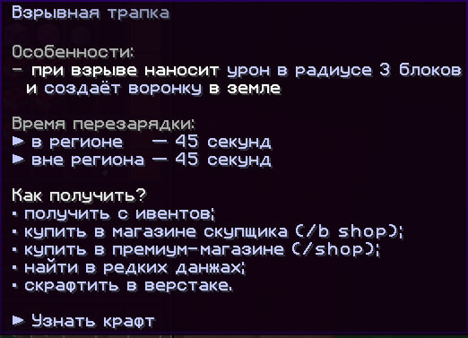

# Кастомные предметы

### Стан
**Механика:** При активации создаёт куб из частиц, блокирующий использование жемчуга Эндера и хорусов  

**Получение:** Ивенты / магазин (/shop) / крафт  

### Взрывная трапка
**Механика:**  
- Работает вне защищённых регионов  
- В воде создаёт стеклянную сферу с эффектом стана внутри  

**Получение:** Верстак / ивенты / магазин (/shop)  

### Трапка
**Механика:**  
- Функционирует вне регионов  
- Создаёт коробку из выбранного материала (настраивается через /custom)  

**Получение:** Ивенты / крафт / магазин (/expkeeper)  

### Взрывная штучка
**Механика:** Создаёт взрыв под игроком при активации  

**Получение:** Ивенты / магазин (/expkeeper)  

### Пузырь опыта
**Механика:** Мгновенно чинит всю броню с эффектом Починки  

**Получение:** Магазин (/expkeeper) / ивенты  

### Быстрая печка
**Механика:** Ускоренная плавка ресурсов  

**Получение:** Ивенты / магазин (/exkeeper)  

### Ком снега
**Механика:**  
- Аналог снежка  
- При попадании накладывает Слепоту и Замедление (10 сек)  

**Получение:** Ивенты / магазин (/expkeeper)  

### Светильник Джейка
**Механика:**  
- Подсвечивает игроков  
- Надевает светящуюся тыкву на 10 секунд  

**Получение:** Магазин (/expkeeper) / ивенты  

### Взрывная палочка
**Механика:** Выстреливает огненным зарядом с минимальным уроном  

**Получение:** Сокровищницы  

### Золотой спавнер
**Механика:**  
- При установке публикует свои координаты в чат анархии  
- Генерирует монеты  
- Имеет шанс сломаться (чем больше монет выдал, тем выше шанс)  

**Получение:** Магазин (/shop) / крафт  

### Загадочное яйцо призыва
**Механика:** При помещении в рассадник спавнит указанных мобов (3 уникальных типа)  

**Получение:** Ивенты / магазин (/shop)  

### Нерушимые элитры
**Механика:** Не могут быть сломаны  

**Получение:** Магазин (/shop) / ивенты  

### Броневая элитра
**Механика:** Даёт защиту как алмазный нагрудник  

**Получение:** Ивенты / магазин (/shop)  

### Особый компас
**Механика:** Раз в 8 часов показывает координаты случайной сокровищницы  

**Получение:** Ивенты / магазин (/shop)  

### Универсальный ключ
**Механика:** Открывает особые данжи и призывает боссов  

**Получение:**  
- Замок  
- Квесты на шахте  
- Магазин (/shop)  
- Ивенты
  

### Кирка Джейка
**Механика:** Позволяет добывать спавнеры мобов  

**Получение:** Ивенты / магазин (/shop) / крафт  

### Прощальный гул
**Механика:** Отбрасывает игроков при активации  

**Получение:** Ивенты / крафт / магазин (/expkeeper)  

### Авто-крафтер
**Механика:** Автоматизирует процесс крафта  

**Получение:** Переименование раздатчика в наковальне  

### Изумрудная пыль
**Механика:** Используется для торговли с деревенскими жителями  

**Получение:** Торговля / ивенты  

