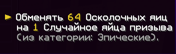
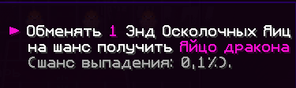

# Осколочные яйца на Holyworld Lite (Анархия)

## Основные способы получения осколочных яиц:
###  Осколочные яйца:
- Участие в регулярных ивентах сервера
- Рейды сокровищниц (шанс выпадения зависит от уровня сокровищницы)

###. Энд-осколочные яйца:
- Участие в еженедельном событии "Захват Энда" (проводится по воскресеньям)
- Разрушение специальных структур в Энде:
  - Мини-постройки с черным сухим бетоном
  - Находятся на эндер-островах
  - При разрушении блока выпадает 1 энд-осколок
  - В энд-данжах
  - При убийстве дракона

## Типы осколочных яиц

###  Обычные
- Цена обмена: 24 осколка → 1 обычное яйцо призыва

###  Редкие
- Цена обмена: 48 осколков → 1 редкое яйцо призыва

###  Эпические
- Цена обмена: 64 осколка → 1 эпическое яйцо призыва

### Энд-осколочные яйца
- Цена обмена: 1 осколок → 0.01% шанс

## Энд-осколочные яйца
- Уникальный дроп: 0.01% шанс получить яйцо дракона

## Основная механика
- Осколочные яйца обмениваются на яйца призыва через NPC Хранителя яиц
- Команда для меню обмена: `/eggkeeper`
- Локации NPC: `/warp eggspawn` или `/warp eggswap`

