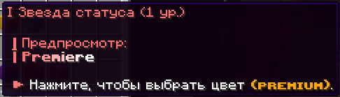
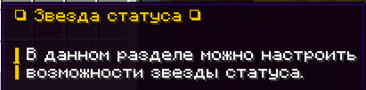

# Механика `/custom`

Функционал, доступный через команду `/custom`, позволяет настраивать различные визуальные и звуковые эффекты, а также получать косметические и статусные дополнения.
Некоторые функции требуют Premium-доступа либо выдаются за активную помощь проекту.

##  Звуки
Добавляет звуковые эффекты в следующих ситуациях:
## Звуки

Настраиваемые звуки, которые срабатывают при определённых игровых событиях. Некоторые звуки доступны только с Premium-доступом.

### При убийстве игрока                              

| Событие                              | Premium |
|--------------------------------------|---------|
| Смерть игрока                        | Нет     |
| Смерть лисы                          | Нет     |
| Смерть оцелота                       | Нет     |
| Смерть свиньи                        | Нет     |
| Смерть хоглина                       | Нет     |
| Злость хоглина                       | Нет     |
| Празднование хоглина                 | Нет     |
| Атака вихря                          | Нет     |
| Разрушение блока иссушителем         | Нет     |
| Попадание трезубцем                  | Нет     |
| Празднование возмутителя             | Нет     |
| Смерть возмутителя                   | Нет     |
| Смерть странствующего торговца       | Нет     |
| Травма эндер-дракона                 | Нет     |
| Заклинание эвокера                   | Да      |
| Подготовка зеркала иллюзианистом     | Да      |
| Подготовка слепоты иллюзианистом     | Да      |

### При критическом ударе

| Событие                              | Premium |
|--------------------------------------|---------|
| Выстрел пули шалкера                 | Нет     |
| Иллюзианист (боль)                   | Нет     |
| Рейдер (боль)                        | Нет     |
| Слизень (падение блока)              | Нет     |
| Душа побег                           | Нет     |
| Незеритовый блок (падение)           | Нет     |
| Железный голем (урон)                | Нет     |
| Шаг коровы                           | Нет     |
| Хаск (звук)                          | Нет     |
| Курица (звук)                        | Нет     |
| Пиглин (боль)                        | Нет     |
| Блейз (боль)                         | Нет     |
| Страж (боль)                         | Нет     |
| Панда (чихание)                      | Нет     |
| Смерть свиньи                        | Нет     |
| Эндер-дракон (боль)                  | Да      |
| Пуля шалкера (удар)                  | Да      |

### При вашей смерти

| Событие                              | Premium |
|--------------------------------------|---------|
| Смерть игрока                        | Нет     |
| Смерть лисы                          | Нет     |
| Смерть оцелота                       | Нет     |
| Смерть свиньи                        | Нет     |
| Смерть хоглина                       | Нет     |
| Злость хоглина                       | Нет     |
| Празднование пиглина                 | Нет     |
| Атака вихря                          | Нет     |
| Разрушение блока иссушителем        | Нет     |
| Попадание трезубцем                  | Нет     |
| Празднование возмутителя            | Нет     |
| Смерть возмутителя                  | Нет     |
| Смерть странствующего торговца      | Нет     |
| Травма эндер-дракона                | Нет     |
| Заклинание эвокера                  | Да      |
| Подготовка зеркала иллюзианистом    | Да      |
| Подготовка слепоты иллюзианистом    | Да      |

Эффекты делают PvP более выразительным и дают быструю звуковую обратную связь о боевой ситуации.

###  Премиум функционал

Доступен игрокам, получившим Premium за помощь проекту или за активную работу в команде сервера.
Включает особые звуковые и визуальные эффекты.

### Телепорт жемчугом края  
(событие: телепортация при помощи жемчуга края)

| Эффект           | Premium |
|------------------|---------|
| Дыхание дракона  | Да      |

### Убийство игрока  
(событие: убийство другого игрока)

| Эффект           | Premium |
|------------------|---------|
| Дыхание дракона  | Да      |

### При вашей смерти  
(событие: смерть игрока)

| Эффект               | Premium |
|----------------------|---------|
| Дыхание дракона      | Да      |
| Голограмма в воздухе | Да      |

Эти улучшения выделяют игроков, участвующих в развитии проекта, и делают игровой процесс насыщеннее.

##  Частицы
### Критический удар

Эти эффекты активируются при нанесении **критического удара**.
Настройки позволяют изменить частицы и визуальное сопровождение события.

| Эффект                              | Premium |
|-------------------------------------|---------|
| Всплеск из игроков                  | Нет     |
| Цветной всплеск                     | Нет     |
| Всплеск из указателя урона          | Нет     |
| Всплеск из дыхания дракона          | Нет     |
| Всплеск из капающей лавы            | Нет     |
| Всплеск из капающей воды            | Нет     |
| Всплеск на эффект                   | Нет     |
| Всплеск из чар                      | Нет     |
| Всплеск из падающей пыли            | Нет     |
| Всплеск из пламени                  | Нет     |
| Всплеск из сердца                   | Нет     |
| Всплеск из большого дыма            | Нет     |
| Всплеск из лавы                     | Нет     |
| Всплеск из ноты                     | Нет     |
| Всплеск из ведьмы                   | Нет     |

Делает боевые столкновения зрелищнее и информативнее.

##  Цвет никнейма
Возможность изменить цвет никнейма на 9 вариантов из предложеных.

I — Звезда статуса (1 ур.) 
 

II — Звезда статуса (2 ур.)  

III — Звезда статуса (3 ур.)  

IV — Звезда статуса (4 ур.)  

V — Звезда статуса (5 ур.)  

VI — Звезда статуса (6 ур.)  

VII — Звезда статуса (7 ур.)  

VIII — Звезда статуса (8 ур.)  

IX — Звезда статуса (9 ур.)  

  

**Требуется Premium-доступ.**

##  Звезда статуса

###Звёзды статуса — это префиксы, отображаемые перед привилегией игрока в TAB. Они автоматически присваиваются в зависимости от общей суммы пожертвований игрока за всё время на сервере Lite Anarchy.

Звёзды подчёркивают вклад игрока в развитие проекта, увеличивают статусность никнейма и предоставляют дополнительные возможности при голосовании через `/vote`.

| Звезда | Сумма пожертвований | Доп. голоса (/vote) | Дополнительно                                     |
|--------|----------------------|----------------------|---------------------------------------------------|
| 1      | от 1000 ₽            | +1                   | —                                                 |
| 2      | от 2000 ₽            | +2                   | —                                                 |
| 3      | от 3500 ₽            | +3                   | —                                                 |
| 4      | от 7500 ₽            | +4                   | —                                                 |
| 5      | от 12500 ₽           | +5                   | —                                                 |
| 6      | от 20000 ₽           | +6                   | —                                                 |
| 7      | от 35000 ₽           | +7                   | —                                                 |
| 8      | от 50000 ₽           | +8                   | —                                                 |
| 9      | от 75000 ₽           | +9                   | —                                                 |
| 10     | от 125000 ₽          | +10                  | Возможность выбрать градиент цвета звезды в TAB  |

Особенности:
- Выдаётся автоматически, в зависимости от общей суммы пожертвований за всё время на сервере Lite Anarchy
- Придаёт вашему нику визуальную престижность
- Даёт бонус к голосованию за ивенты через `/vote` (дополнительные голоса)

##  Скины на перетехнику (трапка и стан)

| Трапки             | Станы               |
|--------------------|---------------------|
| Незер              | Чёрный цвет         |
| Красный незер      | Красный цвет        |
| Чернит             | Белый цвет          |
| Кварц              | Оранжевый цвет      |
| Багровый           | Фиолетовый цвет     |
| Искажённый         | Синий цвет          |
| Пурпур             | Лаймовый цвет       |
| Призмарин          | Светло-голубой цвет |
| Красный песчаник   | Пурпурный цвет      |
| Каменный кирпич    | Жёлтый цвет         |
| Ель                | Голубой цвет        |
| Эндерняк           | Зелёный цвет        |

 

Доступны различные дизайны, включая опцию **рандомного скина**.  
**Требуется Premium-доступ.**

