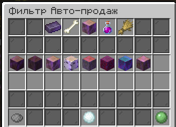

# Скупщик

Открыть скупщика можно по команде `/b` (`/buyer`)  

В этом меню вы можете обменивать предметы на монеты. Более ценные ресурсы дают больше монет и быстрее повышают общий коэффициент. Некоторые ресурсы обменять нельзя.  
Чем больше и ценнее предметов вы сдаете — тем выше становится ваш множитель монет.

Скупщику можно сдавать руды, зелья, дерево, лут с мобов. Подробнее — в `/buyer auto`  
Команда `/buyer auto` автоматически сдает выбранные вещи.

---

### Ресурсы из автошахты (Максимальный  множитель: x1.1)

цхд

| Предмет              | Стандартная цена |
|----------------------|------------------|
| Уголь                | 2                |
| Лазурит              | 3                |
| Редстоун             | 3                |
| Эндерняк             | 3                |
| Кварц                | 25               |
| Железный слиток      | 40               |
| Золотой слиток       | 50               |
| Обсидиан             | 100              |
| Алмаз                | 150              |
| Древний обломок      | 950              |
| Изумруд              | 1000             |
| Незеритовый лом      | 1000             |
| Незеритовый слиток   | 4200             |

---

### Ресурсы с мобов (Максимальный множитель: x1.25)

| Предмет                     | Стандартная цена |
|-----------------------------|------------------|
| Гнилая плоть                | 1                |
| Стрела                      | 1.5              |
| Кости                       | 1.5              |
| Нитки                       | 2                |
| Паучий глаз                 | 4                |
| Стержень ифрита             | 10               |
| Слизь                       | 20               |
| Сгусток магмы               | 25               |
| Шерсть                      | 25               |
| Кожа                        | 40               |
| Жареная баранина            | 40               |
| Жареная свинина             | 40               |
| Эндер-жемчуг                | 50               |
| Череп визер-скелета         | 100              |
| Маринованный паучий глаз    | 125              |
| Порох                       | 125              |
| Светокаменная пыль          | 250              |
| Слеза гаста                 | 750              |

---

### Древесина (Максимальный множитель: x1.5)

| Предмет               | Стандартная цена |
|------------------------|------------------|
| Ель                    | 30               |
| Темный дуб             | 30               |
| Дуб                    | 40               |
| Береза                 | 40               |
| Акация                 | 40               |
| Багровый стебель       | 60               |
| Искажённый стебель     | 60               |

---

### Зелья (Максимальный множитель: x1.5)

| Зелье            | Стандартная цена |
|------------------|------------------|
| Силы II          | 225              |
| Скорости II      | 230              |
| Огнестойкость    | 330              |
| Невидимость      | 400              |

---

### Культуры (Максимальный множитель: x1.25)

| Предмет             | Стандартная цена |
|----------------------|------------------|
| Нарост               | 4                |
| Сладкие ягоды        | 5                |
| Морковь              | 5                |
| Картофель            | 6                |
| Ломтик арбуза        | 10               |
| Бамбук               | 10               |
| Ламинария            | 10               |
| Какао-бобы           | 12               |
| Пшеница              | 20               |
| Свекла               | 20               |
| Плод хоруса          | 24               |
| Тростник             | 80               |
| Арбуз                | 80               |
| Тыква                | 80               |
| Кактус               | 125              |

#Также доступна команда `/buyer shop` — за очки скупщика можно приобрести различные предметы. Стоимость каждого предмета возрастает после каждой покупки.  

**В этом магазине можно потратить очки боевого пропуска (БП) на полезные предметы.**  

---

## Товары с описанием

| Предмет                                 | Описание |
|-----------------------------------------|----------|
| **Ульта Скупщика**                      | При активации вы получаете **на 10% больше монет** с продажи предметов скупщику. Время действия — **1 час**. |
| **Бустер очков Скупщика**               | Увеличивает получаемые **очки скупщика на 20%** с каждой сдачи предметов. Время действия — **1 час**. |
| **Бустер Культур**                      | Увеличивает количество выпадаемых **растений и культур** на **25%**. Время действия — **1 час**. |
| **Жетон на создание личного титула ×1** | Дает право один раз за вайп **создать личный титул**, который будет отображаться у вашего ника. |
| **Донат кейс ×1**                       | Один раз за вайп можно получить **кейc с донат-лутом**. |

---

## Прочие товары

| Предмет                                |
|----------------------------------------|
| **1000 очков опыта**                   |
| **Взрывная трапка**                    |
| **Зачарованное золотое яблоко**        |
| **Осколочное яйцо**                    |
| **Золотая кирка Джейка**               |
| **Элитры**                              |
| **Рассадник**                           |
| **Особый компас**                       |
| **Загадочное яйцо призыва**            |
| **Книга зачарований на Фермер II**     |

---

### Все цены на товары **изменяются в зависимости от спроса** и **сбрасываются 3 раза в сутки**. 

